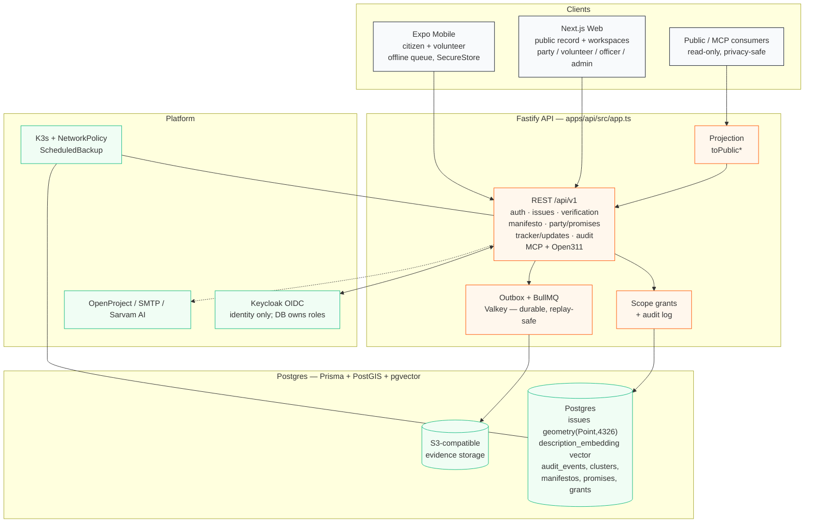

# TGIM — The Great Indian Manifesto

> **TGIM is building an open, auditable protocol for turning citizen evidence into political promises—and political promises into measurable public accountability.**

[](LICENSE)
[](apps/api)
[](apps/web)
[](apps/mobile)
[](https://github.com/devrobinransom/tgim/actions/workflows/verify.yml)

**India's problems, mapped by its people.** TGIM is open civic infrastructure that turns geolocated citizen issue reports into privacy-safe clusters, volunteer-verified evidence, AI-assisted people's manifestos, adopted party promises, and public delivery tracking — with an audit event on every state mutation.

This repository is the reference implementation. It is intentionally public, early in adoption, and designed for reuse across India's overlapping postal, municipal, electoral, and administrative geographies, starting with a constrained real-world proving ground: **Mumbai Suburban District, pincode-first**.

---

## Why TGIM exists

Most civic-tech systems stop at reporting, petitions, or dashboards. The trust chain they leave unsolved is:

**citizen evidence → verification → collective demand → political commitment → measurable implementation → public accountability**

TGIM publishes an open protocol and implementation for that entire chain. The critical design choices are:

- **Evidence before claims.** AI-assisted manifesto text must remain evidence-linked and human-reviewable, with stored source IDs and model metadata.
- **Privacy by design.** Public APIs, exports, maps, and MCP never expose exact citizen coordinates or reporter identity. Public points are derived/jittered or aggregated to pincode / blurred sectors.
- **Trust by audit.** Every mutation of an issue, cluster, promise, or delivery state writes to `audit_events`.
- **Offline-tolerant, mobile-first.** Citizens can report in weak connectivity; drafts queue locally and sync idempotently.

Starting with Mumbai gives TGIM real constraints — 6-digit PIN codes, ward/constituency overlays, multilingual citizens, field volunteers — without claiming to solve democracy globally on day one.

## Ecosystem importance

TGIM is **open infrastructure for evidence-grounded democratic participation in the Global South** — a category that is currently underserved. It is built to be reused by NGOs, municipal bodies, researchers, and community partners, not operated as a closed product. The stack (PostGIS, pgvector, OIDC, Valkey/BullMQ, K3s, offline-first Expo) and the domain model are deliberately portable.

OpenAI Codex and similar maintainer automation have high leverage here: privacy-sensitive location code, authorization boundaries, evidence provenance, multilingual UX, geospatial infrastructure, AI-generated civic claims, CI/release governance, security review, and regression testing are exactly the maintenance load a small OSS team needs help carrying.

## Domain model

```
Issue → Cluster → VerificationEvent → Manifesto → ManifestoPromise → PartyPromise → DeliveryUpdate
                         ↘                                              ↗
                          AuditEvent (on every state mutation)
```

- **Issue** — citizen report with category, severity, privacy level, exact location (private) + jittered public location, optional evidence, idempotency key, pincode.
- **IssueCluster** — grouped issues by area/category/proximity with a `calculatePriorityScore` (log supports, capped report count, severity, verification status → 0–100).
- **VerificationEvent** — volunteer/moderator outcome with checklist + notes; moves a cluster toward `manifesto_ready`.
- **Manifesto / ManifestoPromise** — AI-assisted draft (deterministic provider in sovereign mode) grouped by horizon (100-day / 1-year / 3-year / 5-year), each citing source cluster IDs.
- **PartyPromise** — party adoption of a manifesto promise, with diff against citizen demand. Published revisions are immutable; new drafts cannot mutate published revisions.
- **DeliveryUpdate** — officer update with status (`on_track`/`completed`/`delayed`/`disputed`/`no_update`), evidence URL, and milestone; status propagates to the promise.
- **AuditEvent** — immutable log of every mutation (actor, event type, target table/ID, payload).
- **ActorScopeGrant** — time-bounded, revocable capability grants that gate every privileged mutation by platform/party/organisation/authority/department/area scope.

Privacy invariant: public issue/cluster/manifesto/promise/aggregate/export/MCP/Open311 responses are constructed exclusively through `toPublic*` projections. Reporter identity and exact coordinates never appear in a public DTO.

## Architecture



**Sovereign mode** (`SOVEREIGNTY_MODE=sovereign`) is the production contract: deterministic drafting, Keycloak OIDC with signature/issuer/audience/expiry checks, Valkey/BullMQ, India-hosted Postgres/S3, demo auth disabled, NetworkPolicy + ScheduledBackup. See `docs/SOVEREIGN_RUNBOOK.md` and `docs/RELEASE_GATES_M1_M6.md`.

## Stack

| Layer | Technology |
|---|---|
| Mobile | Expo Router 57 · React 19 · React Native 0.86 · MapLibre · expo-secure-store / file-system / location |
| Web | Next.js 16 App Router · React 19 · MapLibre GL · Lucide |
| API | Fastify 4 · Prisma 5 · Postgres + PostGIS + pgvector · BullMQ + Valkey (ioredis) · S3 (AWS SDK) · Sarvam AI · MCP SDK |
| Shared | `@tgim/shared` — domain types, Zod schemas, `calculatePriorityScore` · `@tgim/api-client` — typed fetch client |
| Infra | K3s (base + overlays) · Keycloak OIDC · SMTP (Nodemailer) · OpenProject · pdfkit + sharp |

## Repository layout

```
tgim/
├── apps/
│   ├── api/            # Fastify server — all routes in src/app.ts, data via src/services/db.service.ts
│   ├── web/            # Next.js App Router — /public · /party · /volunteer · /officer · /admin · /participate
│   └── mobile/         # Expo Router — Home · Explore · Report · Promises · You (field verification offline-tolerant)
├── packages/
│   ├── shared/         # @tgim/shared — single source of truth: types, Zod schemas, formulas
│   └── api-client/     # @tgim/api-client — typed fetch client (bearer + workspace headers)
├── infra/k8s/          # K3s manifests (base + overlays/production) — the only deployment target
├── docs/
│   ├── PRODUCT_PLANS.md          # north star, jobs, milestones M1–M7, role matrix
│   ├── DESIGN.md                 # tokens, category/severity/status colors, mock→screen mapping
│   ├── SOVEREIGN_RUNBOOK.md     # sovereign production runbook
│   └── RELEASE_GATES_M1_M6.md   # M1–M6 release contracts + required evidence
├── mocks/              # Mock 1–8.png — canonical v1 visual source of truth
└── scripts/verify-sovereign.sh  # sovereignty invariant gate (static + live)
```

> **Visual source of truth:** `mocks/Mock 1.png` … `Mock 8.png` define the intended v1 surface; `docs/DESIGN.md` and `apps/web/src/index.css` define tokens. `MEMORY.md` and `docs/superpowers/specs/` define scope/geography/roles. The build is Mumbai Suburban District, pincode-first (400049 / 400053 / 400054 / 400058 / 400064 / 400092) — do not treat mock geographies (Jaipur/New Delhi) as product data.

## Quick start

### Prerequisites

- Node 22, pnpm 11 (`corepack enable`)
- Docker (optional, for Postgres + PostGIS + Valkey)
- No database required for the in-memory walkthrough

### Install

```sh
pnpm install
```

### Run (in-memory — zero infra)

In-memory mode is the fastest way to exercise the full issue → verify → manifesto → adopt → track loop. It seeds fixed records (`default-citizen-id`, `default-volunteer-id`, `ward-12-id`) and is labeled **"In-Memory Simulation Fallback"** in the web UI.

```sh
# Terminal 1 — API (in-memory)
TGIM_IN_MEMORY=true pnpm dev:api
# → http://localhost:3000  (GET /health reports in-memory fallback)

# Terminal 2 — Web (Next.js BFF proxies /api/bff → API)
pnpm dev:web
# → http://localhost:3002

# Terminal 3 — Mobile (Expo)
pnpm dev:mobile
```

Demo roles are server-controlled via `x-demo-role` / `WEB_DEMO_ROLE` (`citizen` · `volunteer` · `party_lead` · `department_officer` · `platform_moderator` · `platform_admin`). Changing a browser URL never changes identity. Demo auth is rejected in sovereign production.

### Run (with Postgres + PostGIS)

```sh
cp .env.example .env
# set DATABASE_URL (Neon or local Postgres with PostGIS + pgvector)

pnpm --filter @tgim/api prisma:generate
pnpm --filter @tgim/api prisma:migrate   # or: prisma migrate dev
pnpm --filter @tgim/api prisma:studio    # optional: inspect data

pnpm dev:api
pnpm dev:web
```

`apps/api/src/services/db.service.ts` branches on `DATABASE_URL`: unset → `InMemoryDb`, set → Prisma via raw `$queryRawUnsafe` for `ST_SetSRID`/`ST_Point`/`ST_X`/`ST_Y` (geometry) and `description_embedding` (pgvector), which are `Unsupported` in the Prisma schema. **When adding a data operation, implement both branches.**

### Environment

Key variables (full list in `.env.example`):

| Variable | Purpose |
|---|---|
| `DATABASE_URL` | Postgres connection (absence = in-memory fallback) |
| `OIDC_ISSUER` / `OIDC_JWKS_URL` / `OIDC_AUDIENCE` | Sovereign OIDC (Keycloak). If unset, demo fallback is used locally |
| `CORS_ORIGINS` | Comma-separated browser origin allowlist (fails closed in production) |
| `AI_PROVIDER` | `deterministic` in sovereign production; OpenAI/Sarvam keys are optional and server-side only |
| `VALKEY_URL` / `BULLMQ_*` | Durable async work (required in sovereign production) |
| `S3_*` / `STORAGE_PROVIDER` | Evidence storage |
| `NEXT_PUBLIC_API_ORIGIN` / `API_ORIGIN_INTERNAL` | Web BFF → API wiring |
| `EXPO_PUBLIC_API_URL` | Mobile → API |

Never commit real secrets. `.env` is gitignored.

## Verification

```sh
pnpm verify
# shared build + api-client build + api build + api test (TGIM_IN_MEMORY=true)
# + web build + mobile lint + mobile test + mobile typecheck

sh scripts/verify-sovereign.sh static   # sovereignty invariant gate
# sh scripts/verify-sovereign.sh live  # requires TGIM_API_URL + TGIM_WEB_URL + runtime env

pnpm lint          # eslint across workspaces
pnpm test          # jest across workspaces (shared + mobile)

# Single-package iteration
pnpm --filter @tgim/shared test
npx jest --filter @tgim/shared -t "clamp scores"
pnpm --filter @tgim/api test
pnpm --filter @tgim/web build
pnpm --filter @tgim/mobile typecheck
```

CI runs `pnpm verify` + `verify-sovereign.sh static` + `kubectl kustomize` build on every PR/push to `master` (`.github/workflows/verify.yml`).

## API surface

All under `/api/v1` (see `apps/api/src/app.ts`), plus `GET /health` and `GET /ready`:

- `auth/role` — role switch (sandbox only)
- `areas` + `/search` — pincode/area hierarchy
- `issues` + `/:id` + `/:id/support` — report + support (jittered public location)
- `verification` — volunteer queue + outcome
- `manifesto` `/generate` + `/:areaId` — evidence-linked drafting (published revisions are immutable)
- `party/promises` + `/adopt` — adoption with diff against citizen demand
- `tracker/updates` + `/:promiseId` — delivery status + evidence
- `audit` — immutable audit log (moderator/admin only)

Mutating routes validate with Zod schemas from `@tgim/shared` and return `400` with `error.flatten()` on failure. Every privileged mutation also writes an `audit_events` row.

## Design system

Tokens live in `apps/web/src/index.css` `:root`:

- Primary gradient `linear-gradient(135deg, #ff7e29 0%, #ff5200 100%)`, accent `#ff5200`, success `#10b981`, warning `#eab308`, danger `#ef4444`
- Font `Outfit` (300–800, logo 900), slate ramp `#0f172a` → `#f8fafc`, 8px grid, radii 6–16px / 40px phone frame
- Category/severity/status colors are canonical — see `docs/DESIGN.md`

Reusable primitives: `.phone-emulator`, `.glass-panel`, `.emulator-card`, `.glow-badge`, `.category-btn`, `.severity-circle`, `.priority-circle-container`, `.sparkline-svg`, `.dashboard-grid`, `.tab-bar`.

## Contributing

**External contributors are welcome.** This is open infrastructure — NGOs, municipal teams, researchers, and community volunteers are invited to contribute, and small focused PRs are preferred over large rewrites.

Start with [`CONTRIBUTING.md`](CONTRIBUTING.md) (setup, branch/commit, verification, design, privacy/audit review) and [`docs/PRODUCT_PLANS.md`](docs/PRODUCT_PLANS.md) (north star, jobs, milestones). By participating, you agree to abide by the civic Code of Conduct in `CONTRIBUTING.md`.

Good first areas: pincode coverage, moderation/visibility, aggregate DTOs, mobile offline states, design-token drift, tests.

## Security

See [`SECURITY.md`](SECURITY.md) for supported versions, how to report vulnerabilities (private advisory or email — not public issues), and the four hard guardrails that define a security defect (privacy leak, scope-grant bypass, missing audit row, production auth bypass).

## License

Apache-2.0 — see [`LICENSE`](LICENSE). Copyright 2026 TGIM Contributors.

You may use, modify, and distribute this work, including for government/NGO reuse and integrations, under the terms of the Apache License 2.0. No trademark grant is implied.

## Acknowledgements

Built for the citizens and civic volunteers of Mumbai Suburban District, starting with Andheri West (400053), Malad West (400064), Juhu (400049), Santacruz West (400054), Andheri East (400058), and Borivali West (400092). The broader Mumbai and India-wide geography planning is tracked in `docs/PRODUCT_PLANS.md` and `docs/RELEASE_GATES_M1_M6.md`.

If you are a civic partner, researcher, or municipal team interested in a pilot pincode, open an issue or discussion — one credible real-world pilot strengthens this project more than any feature.

---

<p align="center"><sub>Questions? Open a <a href="https://github.com/devrobinransom/tgim/issues">GitHub Issue</a> or <a href="https://github.com/devrobinransom/tgim/discussions">Discussion</a>. For sensitive reports, see <a href="SECURITY.md">SECURITY.md</a>.</sub></p>
